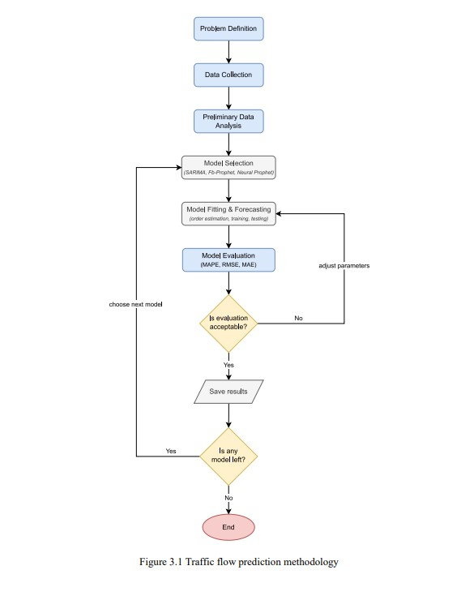
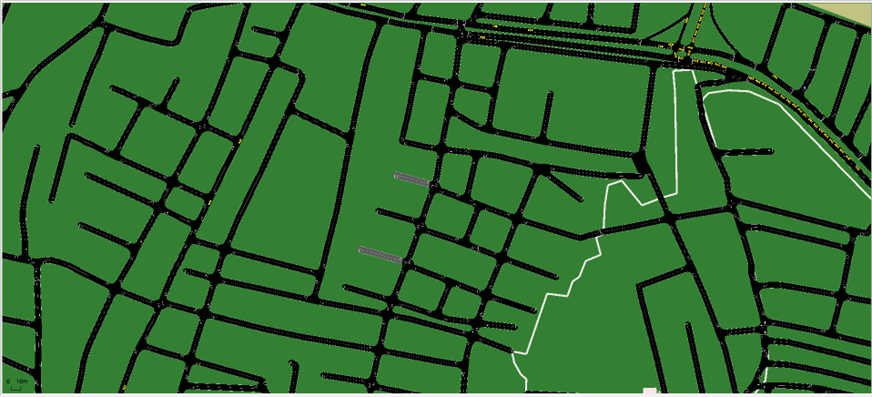
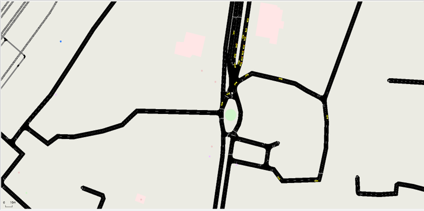

# Comparative Analysis of Urban and Semi-Urban Traffic Flow Using SUMO Simulations

## 1. Abstract
This project explores the differences in traffic flow characteristics between urban and semi-urban environments using SUMO (Simulation of Urban Mobility). The key objective is to compare the effectiveness of traffic light scheduling in managing congestion and emissions. Through simulations, the study evaluates various performance metrics such as vehicle waiting time, traffic throughput, fuel consumption, and congestion levels. Major findings highlight the varying impacts of density and traffic control strategies across different urban settings.

## 2. Introduction

### Background
Rapid urbanization has led to increased traffic congestion, delays, and pollution in cities. Understanding traffic patterns in both urban and semi-urban areas is essential for optimizing traffic management systems.

### Purpose
This study uses SUMO to simulate and compare traffic flows in urban and semi-urban environments, focusing on optimizing traffic light performance to reduce congestion and emissions.

### Problem Statement
Urban and semi-urban areas face different traffic management challenges, including:
- Congestion and delays at intersections
- High emissions due to idling vehicles
- Inefficient traffic signal timing

### Objectives
- To compare the effectiveness of traffic lights in managing urban vs. semi-urban traffic
- To evaluate the impact of traffic flow on congestion and emissions
- To test the efficiency of various traffic light control strategies

## 3. Theory and Background

### SUMO Simulation Tool
SUMO is an open-source traffic simulation tool designed to handle large road networks. It allows for micro-level modeling of vehicle behavior and traffic light scheduling, making it ideal for urban planning and smart traffic control studies.

### Traffic Flow Differences

#### Urban Traffic
- High vehicle density
- Frequent congestion
- Variable and complex traffic patterns

#### Semi-Urban Traffic
- Moderate vehicle density
- Less frequent but longer congestion
- Longer average travel times

### Traffic Light Scheduling
The following traffic light control strategies were explored:
- Fixed-time control
- Adaptive control
- Sensor-based systems

## 4. Solution Methodology

### SUMO Simulation Setup
- Created road network layouts for both urban and semi-urban scenarios
- Defined parameters such as:
  - Vehicle density
  - Speed limits
  - Vehicle types

### Traffic Light Configurations
- Developed unique traffic light timing plans for each environment
- Included different timing plans for peak and off-peak hours

### Data Collection Metrics
- Average vehicle waiting time at intersections
- Traffic throughput (vehicles per hour)
- Fuel consumption and emissions
- Congestion levels (average speed and vehicle density)

### Simulation Scenarios
- **Scenario 1:** Urban traffic with high-density flow
- **Scenario 2:** Semi-urban traffic with moderate-density flow

## 5. Proposed Algorithm and Traffic Light Optimization

### Traffic Light Optimization Techniques
The following algorithms were implemented and tested for traffic light optimization:
- First-Come-First-Served (FCFS)
- Shortest Job First (SJF)
- Greedy Nearest Neighbour
- Round Robin

Each algorithm was fine-tuned to suit the specific needs of urban and semi-urban environments.

### Flowchart
Below is a flowchart representing the logic of traffic light control strategies used in the simulation:

## 6. Results and Analysis

### Traffic Flow Comparison

#### Urban Traffic
- **Congestion:** High during peak hours; frequent stops at intersections.
- **Emissions:** Elevated due to stop-and-go movement.
- **Throughput:** High vehicle count but reduced speed.
- **Average Waiting Time:** Longer, especially at complex intersections.

#### Semi-Urban Traffic
- **Congestion:** Moderate; more continuous flow.
- **Emissions:** Lower due to fewer stops.
- **Throughput:** Steady vehicle count; higher average speed.
- **Average Waiting Time:** Shorter compared to urban settings.

### Key Metrics

- **Waiting Time:**  
  Average time vehicles wait at intersections for both urban and semi-urban scenarios.
  
- **Throughput:**  
  Number of vehicles processed per unit time, indicating efficiency.
  
- **Fuel Consumption & Emissions:**  
  Comparative environmental impact in each setup.

### Visual Representations

- **Bar Plots:**  
  Comparing:
  - Average waiting time
  - Throughput (vehicles/hour)
  - Fuel consumption and emissions

- **Traffic Congestion Visuals:**  
  Speed/density heatmaps or congestion plots from SUMO to illustrate traffic build-up and flow.

